# PCL第一次作业

### 1.PCA

- 计算PCA

```
# 对列求均值 data => (10000, 3)  data_mean => (1, 3)
data_mean = np.mean(data, axis=0)
# 数据归一化操作 normalize_data => (10000, 3)
normalize_data = data - data_mean
# H => (3, 3)
H = np.dot(normalize_data.transpose(), normalize_data)
# SVD分解eigenvectors => (3,3)  eigenvalues => (3,)  eigenvectors_transpose => (3,3)
eigenvectors, eigenvalues, eigenvectors_transpose = np.linalg.svd(H)
```

- 显示点云图像的主成分和次主成分

```
point = [[0, 0, 0], v[:, 0], v[:, 1]]
lines = [[0, 1], [0, 2]]
colors = [[1, 0, 0], [0, 1, 0]]
line_set = o3d.geometry.LineSet(points=o3d.utility.Vector3dVector(point), lines=o3d.utility.Vector2iVector(lines))
line_set.colors = o3d.utility.Vector3dVector(colors)
o3d.visualization.draw_geometries([point_cloud_o3d, line_set])
```

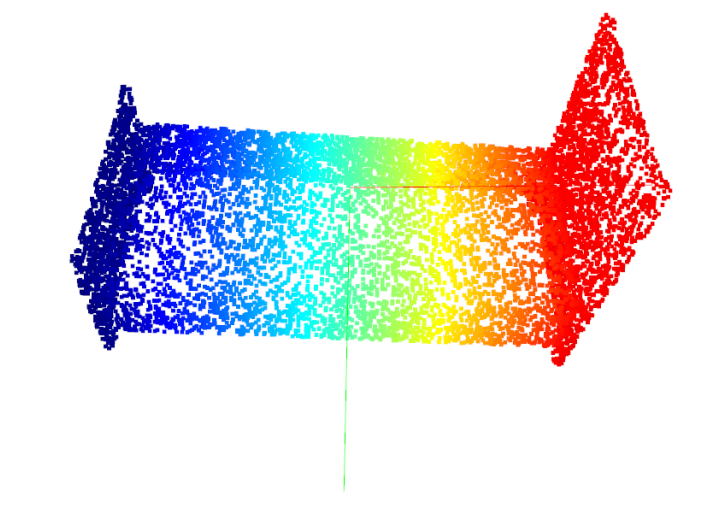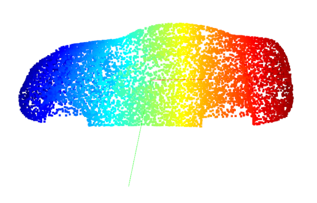

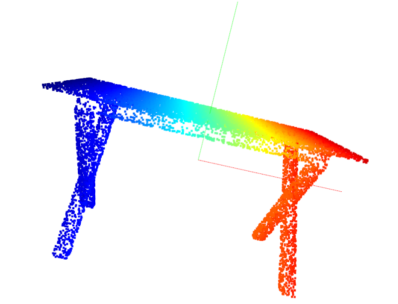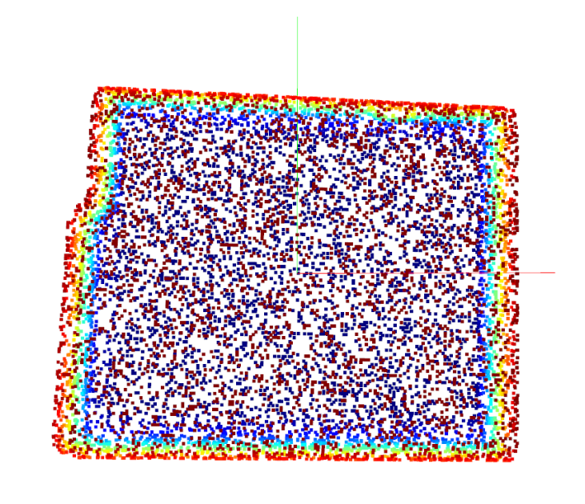


### 2.法向量估计

```
# 每一点的法向量计算，通过PCA降维，对应最小特征值的成分向量近似为法向量
for i in range(points.shape[0]):
    [_, idx, _] = pcd_tree.search_knn_vector_3d(point_cloud_o3d.points[i], 20)
    k_nearest_point = np.asarray(point_cloud_o3d.points)[idx, :]
    w, v = PCA(k_nearest_point)
    normals.append(v[:, 2])
```

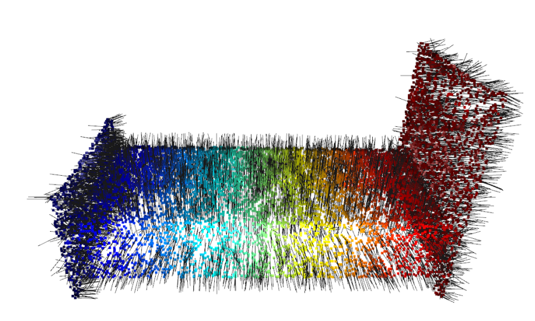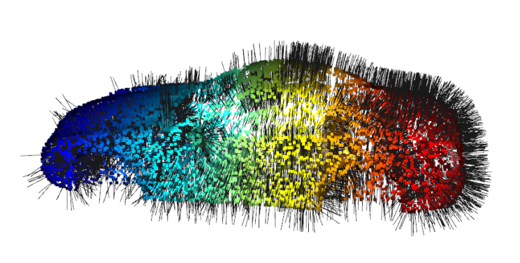

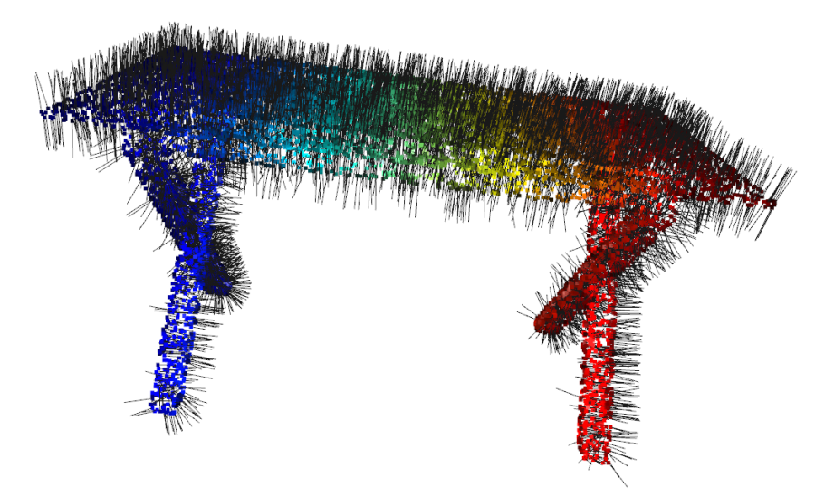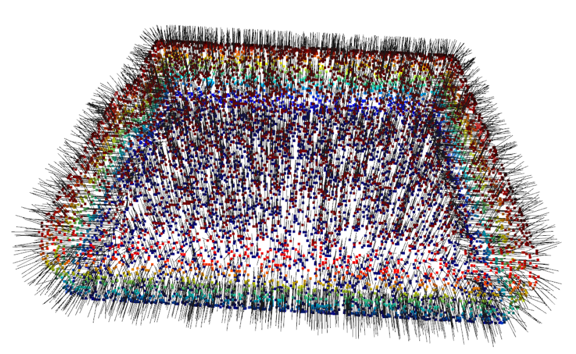

### 3.下采样

#### step1: Compute the min / max of each coordinate

```
x_max, y_max, z_max = point_cloud.max(axis=0)
x_min, y_min, z_min = point_cloud.min(axis=0)
print(x_max, y_max, z_max)
print(x_min, y_min, z_min)
```

#### step2: Compute the dimension of the voxel grid

```
Dx = (x_max - x_min) / leaf_size
Dy = (y_max - y_min) / leaf_size
Dz = (z_max - z_min) / leaf_size
```

#### step3: Compute voxel index for each point

```
point_x = np.array(point_cloud.x)
point_y = np.array(point_cloud.y)
point_z = np.array(point_cloud.z)
hx = np.floor((point_x - x_min) / leaf_size)
hy = np.floor((point_y - y_min) / leaf_size)
hz = np.floor((point_z - z_min) / leaf_size)
H = np.array(np.floor(hx + hy * Dx + hz * Dx * Dy))
```

#### step4: Sort the points according to the index 

```
data = np.c_[H, point_x, point_y, point_z]
data = data[data[:, 0].argsort()]
```

#### step5: Iterate the sorted points, select points according to Centroid / Random method

```
if mode == "random":
    filtered_points = []
    for i in range(data.shape[0] - 1):
        if (data[i][0] != data[i + 1][0]):
            filtered_points.append(data[i][1:])
        filtered_points.append(data[data.shape[0] - 1][1:])
if mode == "centroid":
    filtered_points = []
    data_points = []
    for i in range(data.shape[0] - 1):
        if (data[i][0] != data[i + 1][0]):
            data_points.append(data[i][1:])
            continue
        if data_points == []: continue
        filtered_points.append(np.mean(data_points, axis=0))
        data_points = []
    filtered_points.append(filtered_points)
```

- 原始点云

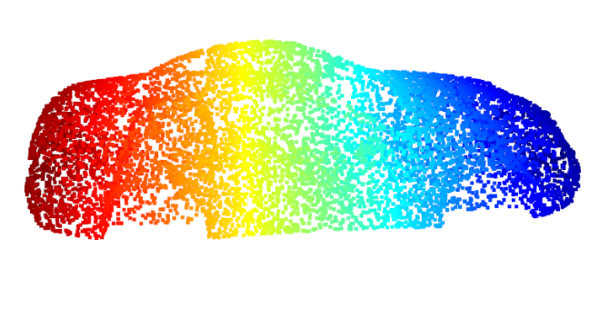

- centroid

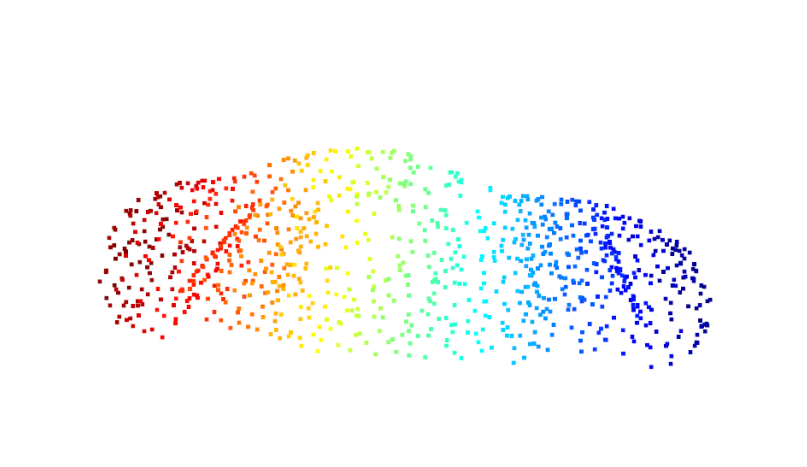

- random

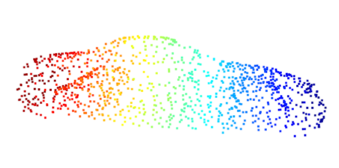


